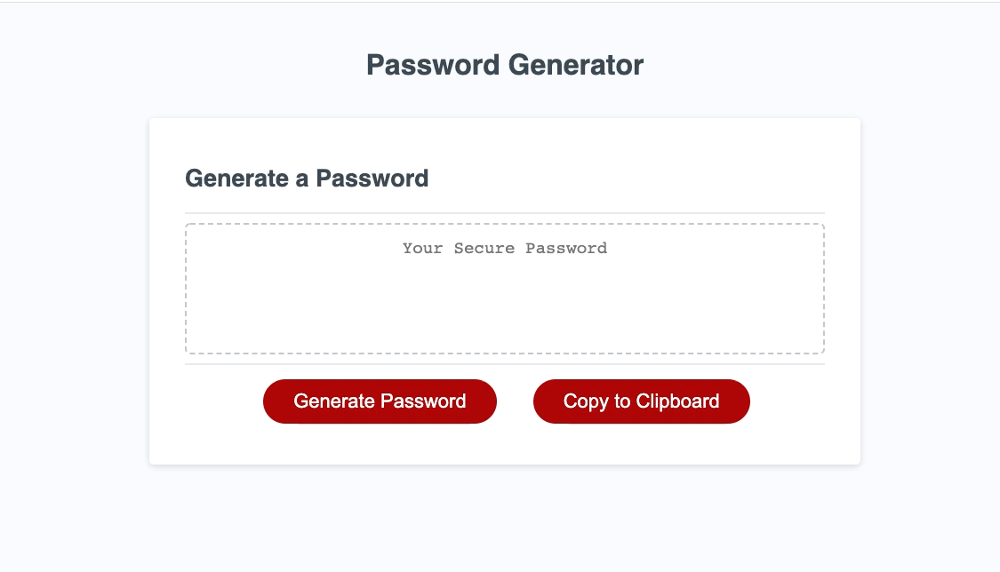

# Bootcamp Challenge: Random Password Generator

## Project Description

This project came with completed HTML and CSS, as well as a few snippets of code within the Javascript.  The client wanted a fully functioning password generator that would incorporate user input in order to customize the parameters for a random password of the desired length of the user.  All code written was done exclusively within the script.js file.

## Finished Project Preview

[Deployed Project](https://littletonjeffrey.github.io/Challenge3/)
[Github Repo Link)(https://github.com/littletonjeffrey/Challenge3)

## Thoughts Behind The Code

This project definitely stretched me.  My first thought to tackle the code in a sequential order of completion.  This led to a couple of days of banging my head against the wall and hyper-fixating on the generate button staying operational during the entire process.  Realizing this course of action was not yielding any meaningful results, I changed my approach.  I decided to start a brand new script.js and index.html and attempt to make the function of the code run in the console.log.  

I drew up a pseudo code which mostly focused on "if this happens, than what?" and this led me to a clear logical path of  progression of code which allowed me to break down the program into it's different components.  I decided to make most of these components as their own individual functions, as this would make them easy to identify where any bugs were and fix/replace.  

Once all the individual functions were created, I needed assistance with how to create the random selector code snippet, which I found online and tweaked to fit the project.  

My tutor, Eric Sayer, helped me to take my code and insert it back into the original script.js file so that it worked flawlessly within the existing code.

At the end I added a "Copy to Clipboard" button, which was not part of the grading criteria, but would improve functionality.  I haven't finished debugging the code for this yet, so it is not functioning at the moment.

## Contributors

- Computational Wizard: [Eric Sayer](https://github.com/sayex)
- Software Ninjaneer: [Sara Baqla](https://github.com/missatrox44)
- Tinkerer: [Cade Coleman](https://github.com/cade-coleman/)
